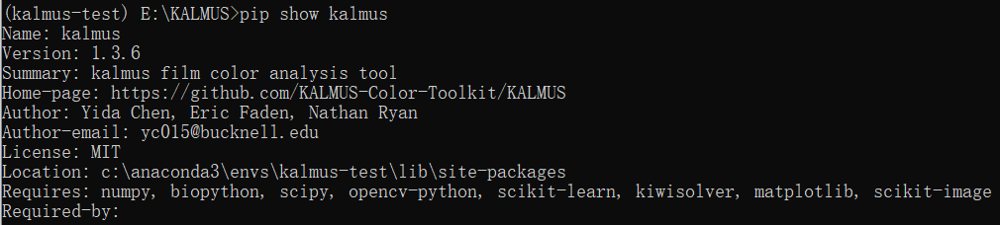

# Welcome to the User Guide for KALMUS (Command-line Interface)!

In this Markdown Tutorial I will introduce:
- **Installation of KALMUS package**
- **How to use the Command-line interface to automate your barcode generation workflow**
- **What are the available argument options for command-line generator**
    - -p --path
    - --color_metric
    - --frame_type
    - --barcode_type
    - --skip
    - -s --step
    - -t --total_frames
    - --num_thread
    - --save_frame_rate
    - --rescale_frame_factor
    - -o --output_path

# Notice

The Command-line Interface of KALMUS is used specifically for **generating barcode** and **saving** it into 
reloadable (via both [API](user_guide_for_kalmus_api.ipynb) and [GUI](user_guide_for_kalmus_gui.ipynb)) JSON object.

We recommend our users to first walk through the IPython notebook Tutorials on either 
[KALMUS's Graphic user interface](user_guide_for_kalmus_gui.ipynb) or [KALMUS's Application programming interface](user_guide_for_kalmus_api.ipynb), 
in which the full functionality of KALMUS is covered.

Once you have been familiar with the API, GUI, or both interfaces, you could further automate your barcode generation workflow 
through this **Command-line interface**.

# Installation Guide

There are two ways that you could install KALMUS on you local machine:  
1. (**Recommended**) Get the latest distribution of KALMUS from PyPI ([KALMUS Project Page on PyPI](https://pypi.org/project/kalmus/)).  
Use command `$ pip install kalmus` or `$ pip install --upgrade kalmus` (if kalmus has been installed) to install the latest version of KALMUS package. All dependencies should be automatically installed during this process.

2. Alternatively, you could install the KALMUS locally by first cloning the GitHub repo of Kalmus ([GitHub page](https://github.com/KALMUS-Color-Toolkit/KALMUS)). Then, move to the top directory of cloned KALMUS project and install using command `pip install .`. 

**See our [Installation Guide](https://kalmus-color-toolkit.github.io/KALMUS/install.html) for more details.**

Once the package is installed, you could verify the version of KALMUS package using command `$ pip show kalmus`  


Alternatively, in version 1.3.7 and above, you can check the version of installed kalmus using its 
`.__version__` attribute.

```jupyter
>>> import kalmus
>>> print(kalmus.__version__) # Warning: The __version__ attribute is not available in the kalmus v.1.3.6 and backward
>>> 1.3.7 
```

## Important!

The **Command-line interface** is a new feature added into the KALMUS in its 1.3.7 version. To use Command-line 
interface, you have to make sure the version of installed KALMUS is 1.3.7 or onward.

# How do I use the command-line interface?

The command-line interface is similar to the **BarcodeGenerator** object, which we have covered in [API Guide](user_guide_for_kalmus_api.ipynb). 
You could invoke the command-line generator using command `$ kalmus-generator`. 

Notice that if you have installed 
kalmus>=1.3.7 but failed to start the kalmus-generator through this command, you could find the corresponding executable 
in your_python_directory/Scripts/ directory on Windows or .local/bin/ directory on Linux.

Check the available arguments for `kalmus-generator` command using the flag `-h`:

```
Windows OS
$ kalmus-generator -h
$ usage: kalmus-generator [-h] -p PATH --color_metric COLOR_METRIC --frame_type
                          FRAME_TYPE --barcode_type BARCODE_TYPE [--skip SKIP]
                          -s STEP [-t TOTAL_FRAMES] [--num_thread NUM_THREAD]
                          [--saved_frame_rate SAVED_FRAME_RATE]
                          [--rescale_frame_factor RESCALE_FRAME_FACTOR]
                          [-o OUTPUT_PATH]
         Command line Barcode generator
         ......
```

# Let's take a quick look at what each argument means!

Only the arguments marked with **(required)** must be specified in the kalmus-generator command.


| Arguments | Description | Type |
| :------- | :----------- | ---- |
| **-p --path (required)**: | The relative or absolute path to the input media/video file. Equivalent to the **video_file_path** in `BarcodeGenerator.generate_barcode` | `str` |
| **--color_metric (required)**:| The color_metric selected for barcode generation. Equivalent to the **color_metric** in `BarcodeGenerator` | `str` |
| **--frame_type (required)**:| The frame_type selected for barcode generation. Equivalent to the **frame_type** in `BarcodeGenerator` | `str` |
| **--barcode_type (required)**:| The barcode_type of the generated barcode. Equivalent to the **barcode_type** in `BarcodeGenerator` | `str` |
| **--skip**:| The number of frames to be skipped at the start of input video before collecting color/brightness. Equivalent to the **skip_over** in `BarcodeGenerator` | `int >= 0` |    
| **-s --step (required)**:| The frame sampled rate. Collect color from one frame every **step** frames. Equivalent to **sampled_frame_rate** in `BarcodeGenerator`| `int >= 1` |
| **-t --total_frames**:| The total number of frames to be included in generated barcode. Equivalent to **total_frames** in `BarcodeGenerator`. **Notice**: If you wish to generate barcode till the end of video, simply put a very large number in  total_frames, e.g. total_frames = 1e8. The barcode will auto adjust the total frames using film length (in frames) and your specified skip_over and sampled_frame_rate to recompute the correct number for total_frames, and barcode generator collects color/brightness till the last frame of input video.| `int >= 0` |
| **--num_thread**:| Number of threads to use in barcode generation. Equivalent to **num_thread** in `BarcodeGenerator.generate_barcode`. We highly recommend this if your processor supports multi-threading. | `int >= 2` |
| **--saved_frame_rate**:| The rate of saving frames (thumbnail quality) in barcode generation (save rate's unit: seconds). Equivalent to **saved_frame_rate** in `BarcodeGenerator.generate_barcode`. The saved frames can be very useful when visualizing barcode in [GUI](user_guide_for_kalmus_gui.ipynb) as you may correlate or validate a segment of colors/brightness barcode with its corresponding frames. **However**, since the size of saved frames/images grows very quickly, you may wish to set this saved rate (seconds) to be low or not to use this option (by default). | `float > 0` |
| **--rescale_frame_factor**:| The factor of rescaling the frames when collecting color. Equivalent to **rescale_frame_factor** in `BarcodeGenerator.generate_barcode`. resize width = sqrt(rescale_frame_factor) x original width, resize height = sqrt(rescale_frame_factor) * original height. We recommend you to use this option speed up the generation process if your input video's resolution is above 2K (or 1K for Top-dominant, Weighted-dominant, Bright color metric and Low/High_contrast_region or Foreground/Background frame type). | `1 > float > 0` |
| **-o --output_path**:| The output path to the saved JSON object. Equivalent to **filename** in `Barcode.save_as_json`. By default, the generated JSON file will be stored on the current directory with filename *saved_{barcode_type}_barcode_{frame_type}_{color_metric}.json* | `str` |

**The available combinations of frame_type and color_metric are the same as those in GUI and API.**

| frame_type \ color_metric | Average | Median |  Mode  | Top-dominant | Weighted-dominant | Brightest | Bright |
| --------------------------| :-----: | :----: | :----: | :----------: | :---------------: | :-------: | :----: |
| **Whole_frame**               | &#9745; |   &#9745;  |  &#9745; |      &#9745;     |        &#9745;    |    &#9745;    |   &#9745;   |
| **High_contrast_region**      | &#9745; |   &#9745;  |  &#9745; |      &#9745;     |      &#9745;      |    &#9745;    |   &#x2612;  |
| **Low_contrast_region**       | &#9745; |   &#9745;  |  &#9745; |      &#9745;     |      &#9745;      |    &#9745;    |   &#x2612;  |
| **Foreground**                | &#9745; |   &#9745;  |  &#9745; |      &#9745;     |      &#9745;      |    &#9745;    |   &#x2612;  |
| **Background**                | &#9745; |   &#9745;  |  &#9745; |      &#9745;     |      &#9745;      |    &#9745;    |   &#x2612;  |

# Example Commands

(1) Generate a **Color** Barcode using **Whole_frame** with **Average** color from the *i_robot_video.mp4* in [notebook_example_data](notebook_example_data). 
**Skip** the first 10 frames of input video, **sample** every frame, and include **100 total_frames.**

```
$ kalmus-generator -p notebook_example_data/i_robot_video.mp4 --frame_type Whole_frame --color_metric Average --skip 10 --step 1 --total_frames 100 --barcode_type Color
```

A JSON file with filename: **saved_Color_barcode_Whole_frame_Average.json** should be generated in this folder after the 
command's execution finished.

(2) Generate a **Brightness** Barcode using **High_contrast_region** with **Median** color from the *i_robot_video.mp4* in [notebook_example_data](notebook_example_data). 
**Not skipping** any frames, **sampled** every 2 frames, and **include all frames till the end**. **Save frames** every 
0.5 seconds, using **2 threads**, and **rescale the frame** by 0.25 during the generation. **Saved the generated barcode** 
in *./saved_barcode_cli.json*

```
$ kalmus-generator -p notebook_example_data/i_robot_video.mp4 --frame_type Low_contrast_region --color_metric Median --step 2 --total_frames 1000000 --barcode_type Brightness --num_thread 2 --saved_frame_rate 0.5 ----rescale_frame_factor 0.25 -o ./saved_barcode_cli.json
```

A JSON file with filename: **saved_barcode_cli.json** should be generated in this folder after the 
command's execution finished.

# Thank you!

Thank you so much for reading through this markdown Tutorial for KALMUS's Command-line interface.
If you find any errors in the instructions, please feel free to email the markdown author, Yida Chen, <yc015@bucknell.edu> 
