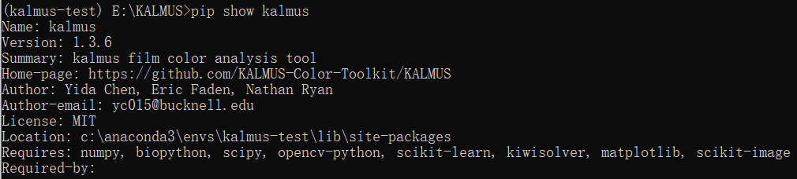
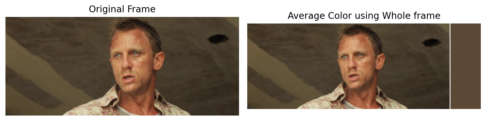
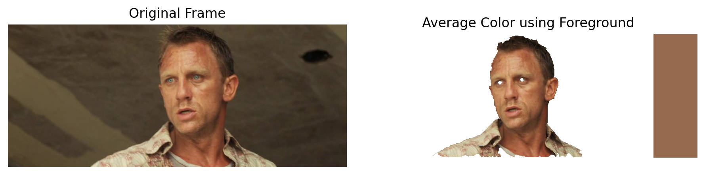
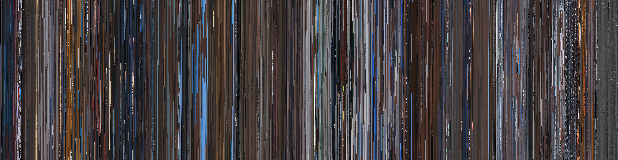
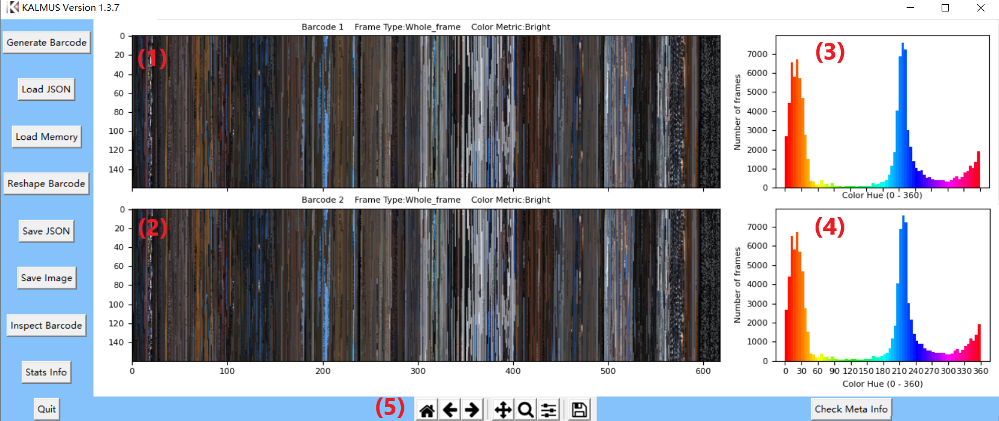
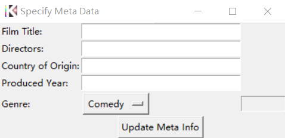
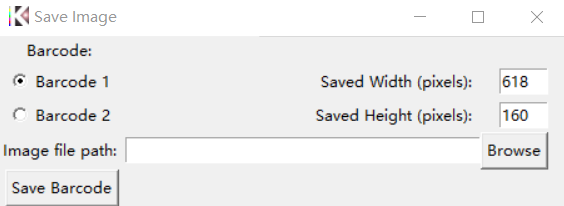
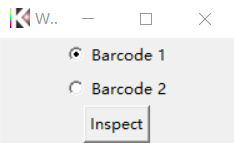
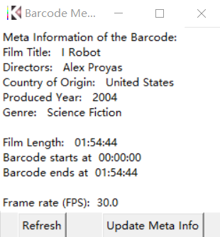

# Welcome to the Markdown User Guide for KALMUS (GUI)!

In this tutorial, I will introduce:  
1. **Installation of KALMUS package**
2. **What is KALMUS for**
    - Extract color information from film frames or brightness information from monochrome film frames using different color metrics and image sampling methods.   
    - Generate a barcode representation of the color/brightness information of a film. 3D information in 2D representation. 
    - Compare different barcodes globally through similarity measures on images. Interpret the difference through similarity scores.
    - Compare segments of barcodes locally using functions embedded in GUI. Interpret the difference using domain knowledge and contextual information extracted by KALMUS.  
3. **How to interact with KALMUS using its Graphic user interface**
    - Visualize barcodes
    - Generate barcodes
    - Change barcodes
    - Save barcodes
    - Load barcodes
    - Compare barcodes
    
## 1. Installation
There are two ways that you could install KALMUS on your local machine:  
1. (**Recommended**) Get the latest distribution of KALMUS from PyPI ([KALMUS Project Page on PyPI](https://pypi.org/project/kalmus/)).  
Use command `$ pip install kalmus` or `$ pip install --upgrade kalmus` (if kalmus has been installed) to install the latest version of the KALMUS package. All dependencies should be automatically installed during this process.

2. Alternatively, you could install the KALMUS locally by first cloning the GitHub repo of Kalmus ([GitHub page](https://github.com/KALMUS-Color-Toolkit/KALMUS)). Then, move to the top directory of cloned KALMUS project and install using the command `pip install .` 

**See our [Installation Guide](https://kalmus-color-toolkit.github.io/KALMUS/install.html) for more details.**

Once the package is installed, you could verify the version of KALMUS package using the command `$ pip show kalmus`  


## 2. What is KALMUS for?
KALMUS is a Python package for the computational analysis of colors in films. It addresses how to best describe a film's color. This package is optimized for two purposes: **(1) various ways to measure, calculate and compare a film's color and (2) various ways to visualize a film's color.**

KALMUS utilizes the movie barcode as a visualization of the film's color. It has a modularized pipeline for the generation of barcodes using different measures of color and region of interest in each film frame. It also provides a set of measures that allow users to compare different films' colors directly through this visualization.

### 2.1 Barcode Generation

Barcode supports __7 color metrics__ that measure the color of a frame and __5 frame types__ that specify which part of the frame will be used in the color measures.

Below is a table of available combinations of color metric and frame type in barcode generation.  

| frame_type \ color_metric | Average | Median |  Mode  | Top-dominant | Weighted-dominant | Brightest | Bright |
| --------------------------| :-----: | :----: | :----: | :----------: | :---------------: | :-------: | :----: |
| **Whole_frame**               | &#9745; |   &#9745;  |  &#9745; |      &#9745;     |        &#9745;    |    &#9745;    |   &#9745;   |
| **High_contrast_region**      | &#9745; |   &#9745;  |  &#9745; |      &#9745;     |      &#9745;      |    &#9745;    |   &#x2612;  |
| **Low_contrast_region**       | &#9745; |   &#9745;  |  &#9745; |      &#9745;     |      &#9745;      |    &#9745;    |   &#x2612;  |
| **Foreground**                | &#9745; |   &#9745;  |  &#9745; |      &#9745;     |      &#9745;      |    &#9745;    |   &#x2612;  |
| **Background**                | &#9745; |   &#9745;  |  &#9745; |      &#9745;     |      &#9745;      |    &#9745;    |   &#x2612;  |

### 2.2 Examples of the color of a frame using a selected color metric and frame type.

Here, we show some example frames with their color extracted using the selected color metric and frame type

In the figures below,  
- On the left of each figure, we show the original frame (with letterboxing if applicable).
- On the right of each figure, we show the extracted region using the selected frame type with __the color of extracted region on the rightmost__.

**Casino Royale (2006) using Average Color with Whole frame or only Region with High (brightness) contrast**

  


---

**Casino Royale (2006) using Average Color with Whole frame or only Foreground of frame**





---

**Incredibles (2004) using Whole frame with Mode color, Top-dominant color, or Brightest color**


---

**Mission: Impossible (1996) using Whole frame and Foreground with Mode or Average color**


---

**I, Robot (2004) using Median color with Whole, Foreground, or Background of frame**


### 2.3 Examples of barcode generated from a whole film using selected color metric and frame type

Below, we show two barcodes generated from a whole film (Mission: Impossible (2006)) using two different frame types.

**Barcode generated using Average color and Whole_frame of each frame**  


**Barcode generated using Average color but only Foreground of each frame**  


**Available options for comparing different barcode visualization**

We provide a set of six comparison metrics for users to assess the similarity between two barcodes.

| Comparison metric | Range |  Tag  |
| :---------------- | ----: | :---: |
| Normalized root mean square error | 0 least similar, 1 most similar | Image Similarity |
| Structural similarity index | 0 least similar, 1 most similar | Image Similarity |
| Cross correlation | -1 anti-similar, 1 most similar | Signal Correlation |
| Local cross correlation | -1 anti-similar, 1 most similar | Signal Correlation |
| Needleman-Wunsch | 0 least similar, 1 most similar | Sequence Matching |
| Smith-Waterman | 0 least similar, 1 most similar | Sequence Matching |

For more details, please see our paper [KALMUS: tools for color analysis of films](../paper/joss-paper.md)


## Get Started...

KALMUS has a low-level API, high-level command-line, and **Graphic user interface** for audiences from all backgrounds to take advantage of its functionality. 

In this notebook Guide, we will focus on the **Graphic user interface** of KALMUS.

## 3. How to interact with KALMUS through Graphic User Interface

If you have installed the KALMUS package on your machine with version 1.3.0 and onward, you can start the GUI using the command:

```
    $ kalmus-gui
```

Alternatively, you could import the main function of the GUI from `kalmus.command_line_gui` module.

```jupyter
>>> from kalmus.command_line_gui import main
>>> main()
```

### 3.1 Main window of KALMUS



- (1) The display 1 of Barcode (barcode image of Barcode Object)
- (2) The display 2 of Barcode (barcode image of Barcode Object)
- (3) A histogram plot of the [hue](https://en.wikipedia.org/wiki/HSL_and_HSV) (0 - 360 degree on the color wheel) distribution of the Barcode image in display 1.
- (4) A histogram plot of the [hue](https://en.wikipedia.org/wiki/HSL_and_HSV) distribution of the Barcode image in display 2.
- (5) Matplotlib's [interactive navigation toolbar](https://matplotlib.org/3.2.2/users/navigation_toolbar.html). Notice that we wish the users to use the **Save Image** button on the left instead of the save button on the toolbar if they only want to save the barcode image (not the whole figure).

The **display (1)** and **display(2)** are clickable plots.

- You can click on any point of the barcode image to get the RGB (Brightness for Brightness barcode) values, (x, y) position, frame index, and time of video at that point.
- You can also check the frames around that point **if you saved the frames** during the barcode generation (see section 3.2 (10) for how to save frames during the generation)


---


---

### 3.2 (6) Generate Barcode Window


- (1) Barcode Color/Brightness metric
- (2) Barcode Frame type
- (3) Barcode type (Color or Brightness)
- (4) Start collecting colors from frames at **Start at** (type: int) (**Optional**: No specified or specify start==0, no frames will be skipped)
- (5) Frame sampled rate: Collect color from one frame every **sampled rate** frame (type: int)
- (6) How many frames included in the generated barcode (type: int) (**Optional**: No specified or specify end. Collect color/brightness till the end of input video)
- (7) Alternatively, you could use the more intuitive time unit.


- (time unit) (4) Start at minutes:seconds of input video (minutes and seconds are all type: int) (**Optional**: No specified or specify start==0, no frames will be skipped)
- (time unit) (5) Period in seconds for one sampled frame (type: float)
- (time unit) (6) End at minutes:seconds of input video (minutes and seconds are all type: int) (**Optional**: No specified or specify end. Collect color/brightness till the end of input video)
- (8) The path to the input video. Users may use the Browse button to locate the media file directly.
- (9) Whether automatically detect the letterbox and remove. Recommend use **Auto**, use manual only if you know the exact location (in pixels) of the letterbox or the input video's letterboxing does not follow the convention (not black or in dark color).
- (10) Whether saved frames during the generation, and save one frame in how many seconds (seconds type: float).
- (11) Whether rescale the frames during the generation. Highly recommend resizing frames if you are using the frame type other than whole_frame or the input video is in high resolution.
- (12) Whether multi-threading the generation process. Highly recommend it if your processor supports multi-threading.
- (13) Start the generation of barcode



- (14) Specify the meta information of the input video. **Warning:** Specify the input video's meta information before you press the generate barcode button! Press Update Meta Info to save the entered entries.

---

### 3.3 (7) Load Json Barcode Window


- Specify the file path to the .JSON Barcode (what is a JSON Barcode? check section 3.6 below)
- Specify the type of barcode saved in JSON
- Specify which barcode display on the Main window that you will load the barcode into
- Press the Load button to load the JSON barcode

---

### 3.4 (8) Load Barcode from Memory Window


- Every barcode generated from the current running GUI or Loaded from JSON barcode will be stored on the memory
- User can load them onto the main display by selecting the name of barcode on the list
- Specify which display on the main window that new barcode will be loaded into
- Press the Load Selected Barcode button

---

### 3.5 (9) Reshape Barcode Window


**There are three options available for users to change the barcode on the display**

- Reshape how many frames==pixels in each column of frames (similar to numpy.ndarray.reshape)
- Scale the barcode image by enlarging or shrinking the barcode image by a factor
- Resize the barcode image to a specific size in pixels

In the window:  
- (1) Show the current spatial size of the selected barcode in the main display (Barcode 1 in this case)
- (2) Select which options to use
- (3) Select which Barcode to change
- Press Process to change the Barcode using the given option and parameters

---

### 3.6 (10) Save JSON Barcode Window


Similar to the load memory window
- Select the barcode on memory (list) that you wish to save locally as a JSON file
- Give the path to the saved JSON file in JSON file path textbox
- Press the Save Barcode button

The attributes of Barcode Object will be stored in a JSON file that can be used to rebuild the Barcode Object (in GUI, you simply reload the JSON barcode through Load JSON Window **section 3.3**)

---

### 3.7 (11) Save Barcode Image Window



- Select which barcode on the main display that you wish to save locally as an image.
- The Saved width and height are automatically filled with the current width and height of barcodes. You could change to your desirable spatial size.
- Specify the path to the saved image file in the Image file path textbox
- Press the Save Barcode button

---

### 3.8 (12) Inspect Barcode Window



You will first be asked which barcode on the main display that you wish to inspect in further details.


In the inspect window there are three options to explore

- (1) Output the color/brightness data of the Color/Brightness barcode into a csv file
- (2) Show the histogram distribution of hue values of the Color barcode or brightness value of Brightness barcode (similar to those in the main display)
- (3) (Only available for Color barcode) Show the distribution of RGB color of the Color barcode in RGB cube.


---

### 3.9 (13) Statistics Information Window


The similarity comparison between the displayed barcodes using a set of six comparison metrics.

**Warning:** The initiation of this window may take tens of seconds.

For more references about these six comparison metrics, please check section 2.3 above.

---

### 3.10 (14) Check Meta Information Window

Similarly to the **Inspect Barcode Window**


You will first be asked which barcode on the main display that you wish to check for meta information.



- A list of meta-information will be shown here
- To update the meta information, similarly to Specify Meta Info in the barcode generation, use the Update Meta Info button


- Hit the Update Meta Info button in the Specify Meta Data window after you update the entries.
- Hit Refresh in Check Barcode Meta Information Window to see the updates
- To reflect the updates on the title of plots in the main display, find the barcode with updated meta information in the memory using the Load Memory button and load the updated barcode back to the main display.

---

### 3.11 (15) Quit

Quit the KALMUS's GUI. **Be sure to save all the barcodes you like before you quit the program, and make sure the Generate Barcode Window is closed before quitting**.

---

## 4. Thank you!

Thank you so much for reading through this markdown tutorial! If you find any errors in the instructions, please feel free to email the tutorial author, Yida Chen, <yc015@bucknell.edu>
