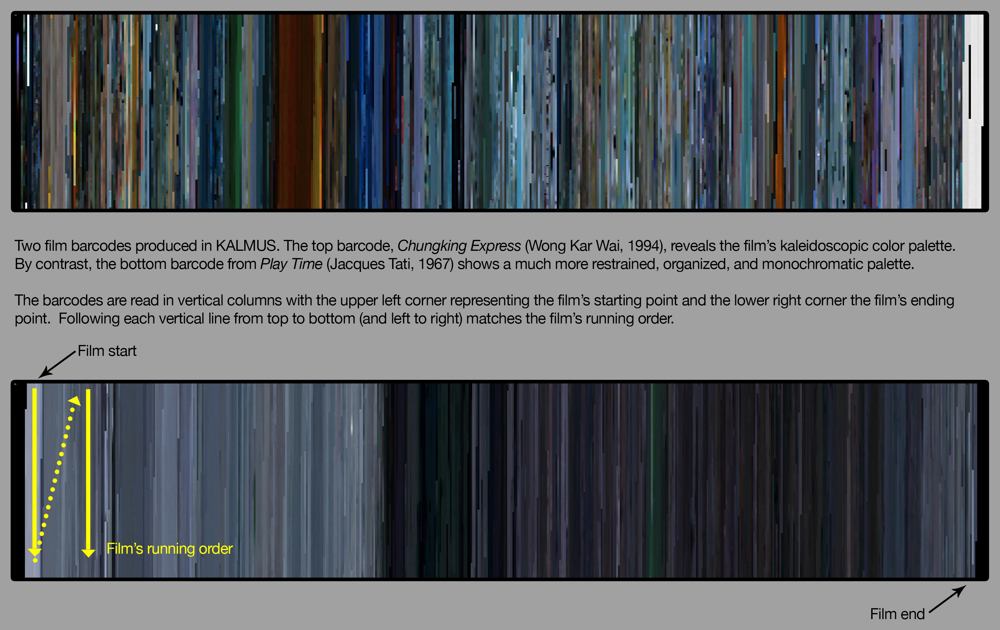

# Summary

KALMUS is a Python package for the computational analysis of colors in films. It provides quantitative tools to study and compare the use of film color.  This package serves two purposes:  (1) various ways to measure, calculate and compare a film's colors and (2) various ways to visualize a film's color.  We have named the software KALMUS in homage to Natalie Kalmus (1882 - 1965), a Technicolor Director who oversaw the color palettes of nearly 300 Hollywood feature films.

# Statement of Need

>“Colors are elusive”

Barbara Flueckiger [-@flueckiger2017digital]

>“Color is in so many ways uncontainable.”

Josh Yumibe [-@yumibe2012moving]

The epigraphs above (each from the introduction of recent research on cinematic color) all acknowledge the challenges of studying cinematic color aesthetics.  Filmmakers, cinematographers, production designers, and colorists spend significant money, time, and labor deciding a film’s color palette before, during, and after production.  Given this obsessive attention, why is color so “elusive” to study and analyze?  

Three reasons emerge: (1) film color remains subtle and almost subliminal by design; (2) we read color subjectively and are often influenced by cultural or even historic circumstances; (3) films are kinetic with the image (and colors) constantly moving.  Color might be relatively easy to observe in a single frame, but tracking the color palette across an entire film proves daunting.  Moreover, comparing one film’s palette to another proves especially challenging due to the accumulation of data needed to make a meaningful comparison.  See [@flueckiger2020, @stutz] for an overview of both the history and the state-of-the-art of the study of colors in film.

Recently, several digital tools have emerged that analyze a film’s color.  The ability to capture film stills from DVD or streaming sources and analyze the frame’s palette in off-the-shelf tools like [Adobe Color](http://color.adobe.com) or Adobe Photoshop provide insights into individual frames.  Additionally, many open-source projects provide implementations of state-of-the-art computer vision algorithms applied to moving images.  Some, such as the Distance Viewing Toolkit [@arnold], are very general and handle several aspects of a moving image at once (sound, color, camera angle, etc.).  Others, such as VIAN [@vian], allow for a "closer", more interactive distant viewing.  

KALMUS is built around a visualization of films known as movie barcodes; it produces an overall color palette “snapshot” of a film.  Artists like [Jeffrey Moser](http://www.jeffreymoser.com/) or programmers such as [Charlie Clark](https://thecolorsofmotion.com/about), generate movie barcodes by reducing each film frame to a single color[^1] and then stitching these colors into a mosaic.  Existing movie barcode software, without relevant statistical tools, is inadequate for studying films.  While they provide a fascinating visual “overview” of a film’s color palette, the software focuses more on visualization rather than providing meaningful analytical data.  KALMUS generates barcodes but also generates a quantitative color palette (see Figure 2) so that users can carry out their own analyses.  See Figure 1 for examples of movie barcodes.  

[^1]: In OpenCV [@opencv], for example, if a frame is decimated to a single pixel, its color is determined by area interpolation, a weighted average of the RGB-values of the pixels.

KALMUS allows for the analysis of a film's color by:  
::: {.block}
1. Providing an interface that takes in either a video file or a JSON file (a sample JSON file can be found [here](https://github.com/KALMUS-Color-Toolkit/KALMUS/blob/master/kalmus/data/mission_impossible_Bright_Whole_frame_Color.json)).
2. Allowing for the computation of a frame's color in a number of ways (dominant, median, etc).
3. Allowing for the computation of a film's color in a number of ways. 
4. Providing implementations of ways to compare colors of two films. 
5. Providing implementations of ways to visualize the color of a film.
6. Allowing the user to download color data as a CSV or JSON file.  See Figure 2 for an explanation of KALMUS's user interface.
:::  

![Image A shows barcodes for a single film in which the color of a frame was calculated in two ways:  the top one uses the frame's brightest color and the bottom one uses the frame's median color.  Image B shows the interface for generating a barcode: one can process a film in parallel, choose a sampling rate, and choose a method for determining a frame's color.  Image C is the result of selecting a pixel in a barcode to give a user an idea of where in the film they are.  Image D is a table of similarity metrics between the two barcodes.  Image E is an interactive 3D plot of the RGB values in one of the barcodes.](images-joss/kalmus-interface.jpg)

KALMUS allows users to understand a film’s color palette and compare that palette to other films.  See Table 1 for options on what parts of the frame a user might want to analyze and the various metrics a user can use to determine the color of a frame.  See Table 2 for information on how film colors can be compared.  Potentially, films from a certain time period or a particular genre might be aggregated to see if there are common color palettes.  While film studies as a discipline has long depended on qualitative analysis, KALMUS provides a straightforward quantitative tool that can supplement the reading of a film.  For example, in [@adams] KALMUS is used to study color trends in Hollywood movies from 1990 to 2015.  In a class taught by the second author, students used KALMUS to explore how a film's color palette signaled narrative shifts and introduced significant characters.

|                     | Mean	| Median   | Mode	| TD	| WD	| BR	| BP  |
| :-------------------| ----: | -------: | ---: | --: | --: |---: | --: |
| Whole frame	        | Yes   | Yes      | Yes  | Yes | Yes | Yes | Yes |
| High contrast region	| Yes | Yes | Yes | Yes | Yes | Yes | No |
| Low contrast region	| Yes | Yes | Yes | Yes | Yes |  Yes |No |
| Foreground	| Yes | Yes | Yes | Yes | Yes |  Yes | No |
| Background	| Yes | Yes | Yes | Yes | Yes |  Yes | No |

Table 1:  A summary of the various metrics one can use to determine the color of a frame and what parts of a frame will be used to calculate the color of the frame.  The first three metrics (mean, median and mode) are the corresponding statistic over all the colors in the part of the frame being analyzed.  The next two metrics, top dominant (TD) and weighted dominant (WD) are determined by applying a clustering algorithm on the set of all the colors in the part of the frame being analyzed and, in the case of the top dominant metric, the color is determined by the color of the largest cluster and, in the case of the weighted dominant metric, the color is determined by the average color of the clusters, weighted by the sizes of the clusters.  The last two metrics assign the color of the region being analyzed to be the color of the brightest region (BR) or the brightest pixel (BP) in the region.

\small
| Comparison metric | Range | References |
| :---------------- | ----: | --------: |
| Normalized root mean square error | 0 least similar, 1 most similar | @wang  |
| Structural similarity index | 0 least similar, 1 most similar | @wang |
| Cross correlation | -1 anti-similar, 1 most similar | @avants|
| Local cross correlation | -1 anti-similar, 1 most similar | @avants |
| Needleman--Wunsch | 0 least similar, 1 most similar | @needleman |
|                   |                                 | @adams |
| Smith--Waterman | 0 least similar, 1 most similar | @smith |
|                 |                                 | @adams |
\normalsize
Table 2:  A summary of the various metrics included in KALMUS to compare the overall color of two films.

As of version 1.3.5, the software is stable.  Because the audience of potential users of KALMUS is broad, we provide access to the KALMUS package via the GUI described above but also point out that the package can be installed and used in any Python environment.

# Acknowledgments
The authors wish to thank the Mellon Foundation, the Dalal Family Foundation, and the Bucknell University Humanities Center for their support on this project.

# References

